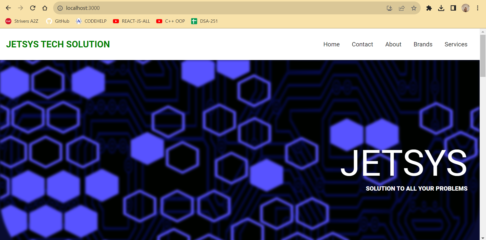
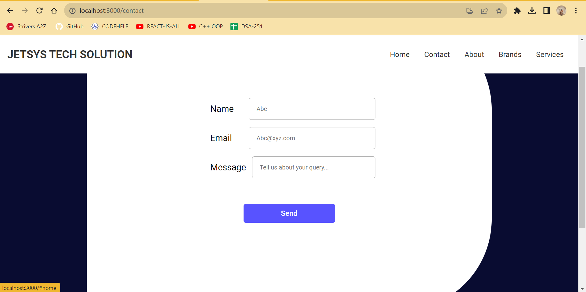
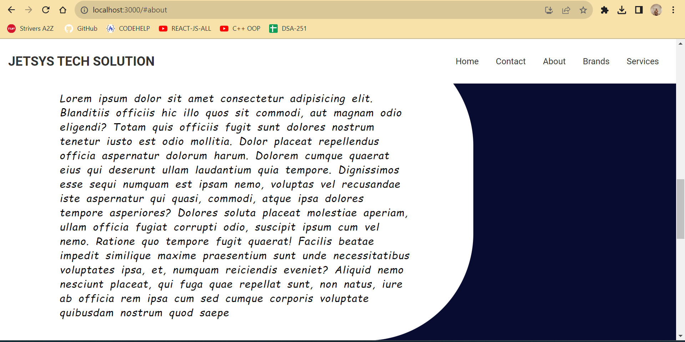
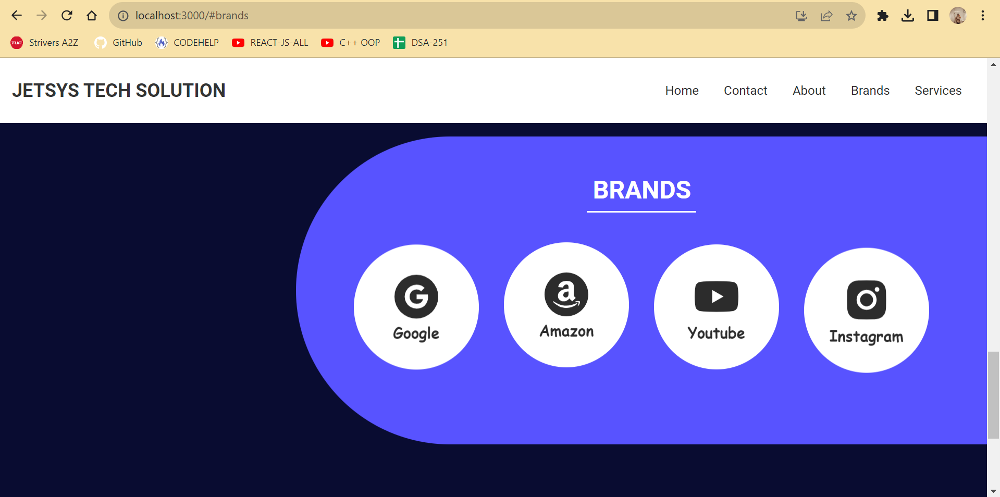
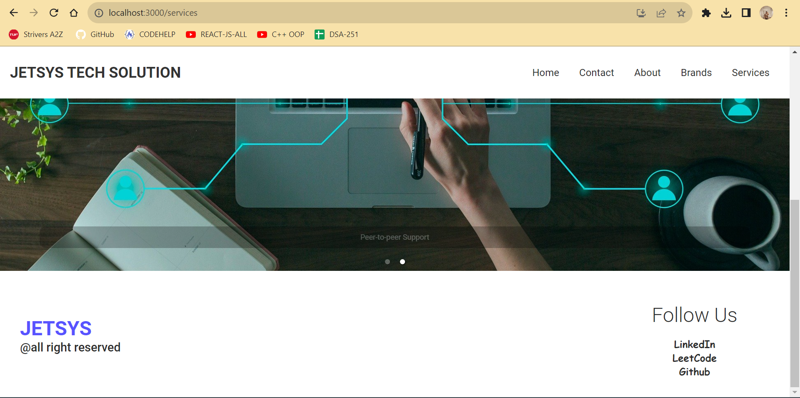

# JETSYS - Technology Solutions and Consultancy Website

## Description

JETSYS is a responsive website built using React that serves as a platform for a technology solutions and consultancy company. The website showcases the company's services, provides information about the team, and offers a contact form for inquiries.

## PROJECT_OUTPUt

## Table of Contents

- [Technologies Used](#technologies-used)
- [Project Structure](#Project-Structure)

## Technologies Used

- **React**: The project is built using React, a JavaScript library for building user interfaces.
- **React Router**: React Router is used for client-side routing to navigate between different pages of the website.
- **react-icons**: This library is used to display icons of popular brands on the Brands page.
- **react-responsive-carousel**: The carousel on the Services page is implemented using this library.

## Project Structure
**src**: Contains the source code of the project.
**components**: React components used in the project.
**assets**: Images and other static assets.
**styles**: CSS stylesheets.
**public**: Public assets and the index.html file.
Key Functions
**Home Component**
The Home component displays the homepage of the website, including a title and a brief description.

**Contact Component**
The Contact component renders the contact page, featuring a contact form where users can submit inquiries.

**Header Component**
The Header component represents the navigation header of the website, allowing users to navigate to different sections.

**Services Component**
The Services component displays a carousel of services offered by JETSYS, utilizing the react-responsive-carousel library.

**Footer Component**
The Footer component represents the footer section, containing company information and social media links.

